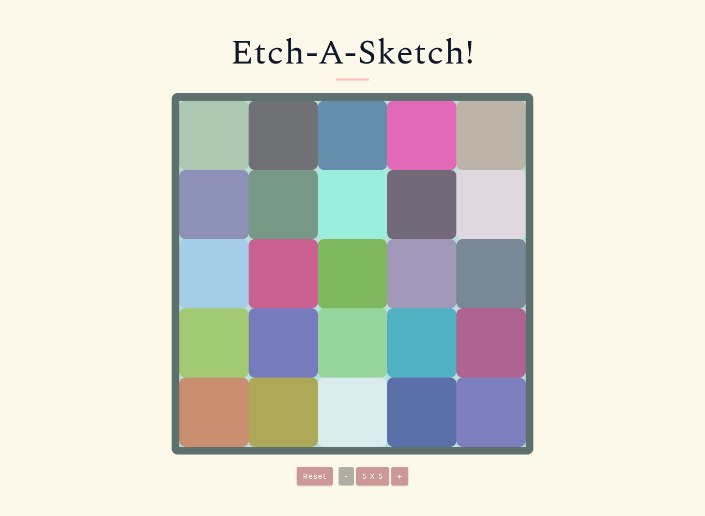
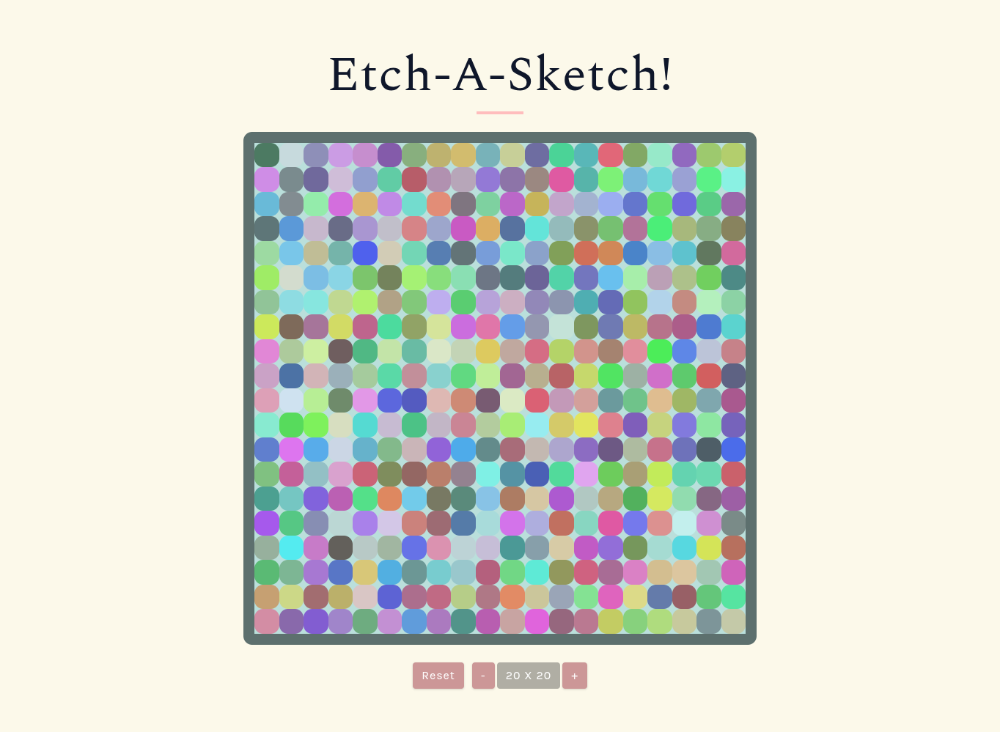

# etch-a-sketch

A browser-based etch-a-sketch game.

## 🚀 Live Demo

[Link to live demo.](https://thepaladindev.github.io/etch-a-sketch/)

## 📸 Preview

|                             Hero 5 x 5 View                             |                            Hero 20 x 20 View                             |
| :---------------------------------------------------------------------: | :----------------------------------------------------------------------: |
|  |  |

## 🛠 Tech Stack

- HTML
- CSS
- JS
- git

## 💻 Getting Started

To view this project locally:

1. Clone the repository.
   ```bash
   git clone git@github.com:ThePaladinDev/etch-a-sketch.git
   ```
2. Navigate into the directory.
   ```bash
   cd etch-a-sketch
   ```
3. Start a local HTTP server:<br>
   - VS Code: Use the [Live Server](https://marketplace.visualstudio.com/items?itemName=ritwickdey.LiveServer) extension.
   - Node.js: Run `npx serve .` (Default port: 3000).
   - Python: Run `python -m http.server` (Default port: 8000)

4. Open your browser and navigate to the URL provided in your terminal (e.g., `http://localhost:PORT/`).

5. Stop the server by pressing `Ctrl+C` in the terminal once you're done testing the project.

## ✨ Features

- **Dynamic Grid Sizing:** Adjust game board with size controls.
- **Responsive Design:** Designed to work across various screen sizes.
- **Interactive UI:** Wipe the board, change size, get back to default size.

## 🏔️ Challenges

- Using Flexbox to implement an otherwise easy grid layout design.
  - This is done to get some practice with Flexbox.
- Managing game board using only Flexbox.
  - Used a nested flexbox board, on container for rows and on each row for cells. Used `flex: 1` for completely filling the space and dynamic sizing of board based on screen size.
- Handling the interactions of up to a maximum of 80 x 80 cells.
  - Attached a single event listener to the game board to handle interactions with any number of cells that the game board could ever contain.
- Accessibility & UX.
  - Allowing only 'doubling' and 'halving' the game board size and not a text input or slider makes the experience so much better.
  - To make minimum and maximum size limits of the game board obvious, I disable and change the color of the game board controls.
- State Management:
  - A lot of controls need to change the board size and/or remake the entire board. Used a `currentSize` variable as a single source of truth which is modified and used by all of them.

## 🧠 What I learned

- **UX Design:**
  - Visually communicating game board limits by changing color and disabling control buttons instead of doing it via text.
  - Clicking on the current game board information will resize the game board back to default size.
- **Flexbox:**
  - Used the 'Flex' layout to create the game board and make it scale with screen size.
- **CSS:**
  - Used CSS reset, variables, and a combination of shades and tints of colors to make a color palette for the page.
- **JavaScript:**
  - Made clean, modular functions such that if they don't need to know about the DOM, they don't.
  - Manipulate CSS from the script to make the game interactive as well as add effects.
  - Made functions to cleanup or remake the game board, like resetting the board, going back to default board size, resizing the game board.
  - Used `mouseover` event to add effects to the game.
  - Toggle a CSS pseudo-class, which in turn toggles styles because it is styled in the CSS, to do things like change button color and disable it in response to hitting the board size limits.
  - Used **Event Delegation**. A single event listener on the parent container to listen and respond to all the 'mouseover' events on game board cells, and also 'click' events on game board controls.
- **Game Effects:**
  - Hovering over a cell on the game board for the first time adds a random color to it.
  - Re-hovering on a cell gradually reduces their opacity, and they eventually turn transparent after a few hovers.

## 🏁 Conclusion

It was a joy making this project. Figuring out a basic state management for the app, game effects, how to indicate game board limits with UI, and the way to handle the game board resizing were the best parts.

## 📜 License

This project is licensed under the MIT License - see the [LICENSE](./LICENSE) file for details.
